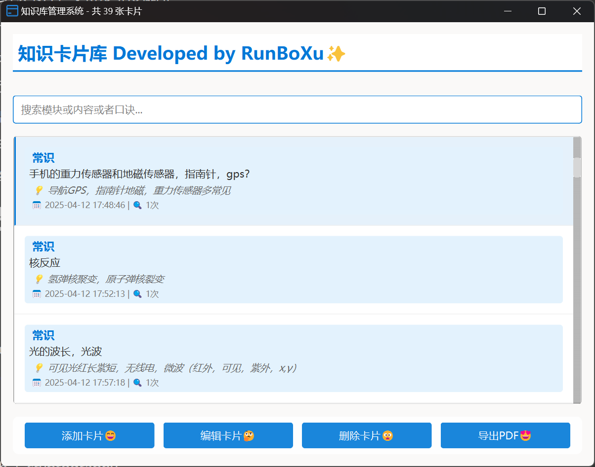
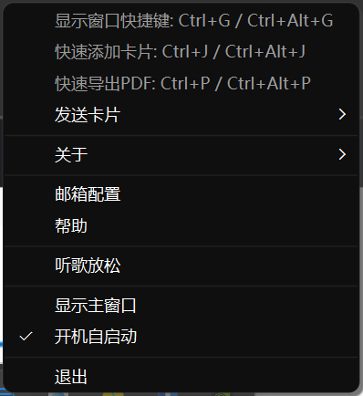

# 📚 知识卡片管理系统


一个优雅的知识卡片管理工具，帮助您高效组织和记忆重要知识点。采用微软Fluent Design风格设计，提供美观易用的界面和强大的功能。

## ✨ 功能特性

- **卡片管理**：创建、编辑、删除知识卡片
- **智能分类**：按模块组织卡片，支持多维度排序
- **记忆辅助**：为每张卡片添加记忆口诀
- **学习统计**：自动记录卡片查询次数
- **可视化反馈**：根据查询次数自动调整卡片颜色
- **数据导出**：支持导出为PDF格式
- **邮件发送**：定时/手动发送卡片到邮箱
- **系统集成**：支持系统托盘和全局快捷键

## 🖥️ 界面预览



  

## 🛠️ 技术栈

- **前端**：PyQt6 (Fluent Design风格)
- **后端**：Python 3.10+
- **数据库**：SQLite3
- **PDF导出**：fpdf2
- **邮件服务**：smtplib + cryptography

## 📦 项目结构

KnowledgeBaseApp/
├── main.py                 # 程序入口
├── ui/                     # 界面代码
│   ├── main_window.py      # 主窗口
│   ├── add_card_dialog.py  # 添加卡片对话框
│   └── ...                 # 其他对话框
├── database/               # 数据库相关
│   ├── db_manager.py       # 数据库管理器
├── models/                 # 数据模型
│   ├── knowledge_card.py   # 卡片模型
├── styles/                 # 样式表
│   ├── styles.qss          # Qt样式
├── utils/                  # 工具类
│   ├── email_manager.py    # 邮件服务
│   └── export_pdf.py      # PDF导出
└── resources/              # 资源文件

## 🚀 快速开始

1. 安装依赖：
```bash
pip install -r requirements.txt
```

2. 运行程序：
```bash
python main.py
```

3. 使用说明：
- 主界面：管理所有知识卡片
- 快捷键：
  - `Ctrl+G`：显示/隐藏主窗口
  - `Ctrl+J`：快速添加卡片
  - `Ctrl+P`：导出PDF

## 📝 开发文档

### 数据库设计
```sql
CREATE TABLE knowledge_cards (
    id INTEGER PRIMARY KEY AUTOINCREMENT,
    module TEXT NOT NULL,
    content TEXT NOT NULL,
    mnemonic TEXT,
    created_at TEXT DEFAULT CURRENT_TIMESTAMP,
    updated_at TEXT DEFAULT CURRENT_TIMESTAMP,
    query_count INTEGER DEFAULT 0
);
```

### 样式规范
```css
/* 卡片样式 */
.card {
    background-color: #f8f9fa;
    border: 1px solid #e9ecef;
    border-radius: 8px;
    padding: 16px;
    margin-bottom: 12px;
}
```

## 🤝 贡献指南

欢迎提交Issue和PR！请遵循以下规范：
1. 提交前运行代码格式化
2. 保持代码风格一致
3. 为新增功能添加测试

## 📜 许可证

MIT License © 2023 xurunbo.top

---

> "知识就是力量" — 弗朗西斯·培根
